

    <h1> Projeto DBM 18/19</h1> 
    <h2>Manual Técnico</h2>
    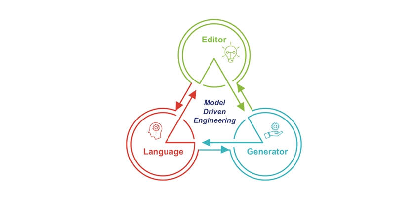

<h4>Professor: Filipe Mariano</h4>
<h4>Alunos: </h4>
<h5><li>Bruno Rodrigues nº:150221041</h5>
<h5><li>Tiago Rodrigues nº:160221081</h5>

<h2>
#Indice
</h2>

1. [Introducão](#Introducão)
2. [Arquitectura](#Arquitectura)
3. [Especificações](#Especificações)
   1. [Integração](#Integração)
   2. [Descrição](#Descrição)
4. [Esquematização e análise](#Esquematização)
5. [Identificação e descrição](#Identificação)
6. [Descrições dos modelos utilizados](#Descrições)

<h2>

**#Introducão**

</h2>

Este manual foi desenvolvido com o objectivo de explicar e facilitar o uso do nosso website, onde é utilizado geradores e linguagens para gerar a maior parte do código representado.

Foi utilizado:
-   **mustache**: uma implementação de sistema de templates de _mustache_ em _JavaScript_. _Mustache_ é uma sintaxe de _templates_ sem lógica. Pode ser utilizado para HTML, arquivos de configuração ou código fonte.

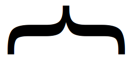

-   **node.js**: é um interpretador, open-source (codigo aberto), de código JavaScript de modo assíncrono e orientado a eventos;

-   **html**: linguagem utilizada na construção de páginas na web;

-   **api**: conjunto de rotinas e padrões estabelecidas num software para a utilização das suas funcionalidades por aplicações que não pretendem envolver-se na implementação do software, mas apenas usar seus serviços;

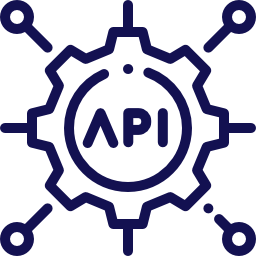

<h2>

**#Arquitectura**

</h2>

O projecto possui a seguinte arquitectura:

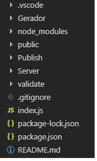

- **Gerador** : pasta aonde estão modelos e os geradores de código;
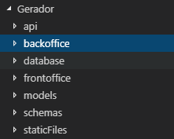

- **node_modules** : aonde estão os pacotes colocados depois de serem instalados;
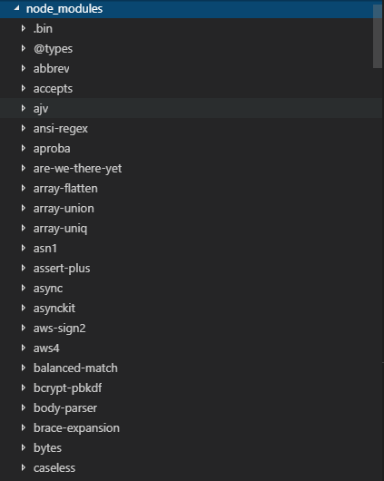etc...

- **public** : aonde está a pagina inicial e aonde estão os css/html/imagens utilizadas;
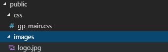

- **Publish** : aonde é colocado todo o código gerados;
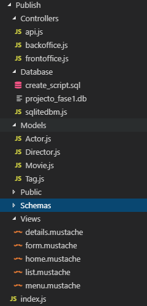

- **Server** : aonde está os config.json e aonde que incializam e ocupam o servidor;

- **index.js**: o código do servidor inicial;

 

<h2>

**#Especificações**

</h2>

Iremos aprofuntar as especificações dos elementos utilizados no projecto.

<h3>

**Especificação dos diversos componentes do projeto e integração dos mesmos**

</h3>

**O que são geradores de código?**

 Geradores de código, juntamente com linguagens específicas do domínio (DSL), são ,hoje em dia,  uma  prática cada  vez  mais  comum na  programação pois optimição a criação do código utilizado e elevam a qualidade do código e aumentam a eficiencia na parte de reutilização de código que utilizam.

Foram utilizados neste projecto para gerar, apartir dos templates de _mustache_, código na parte _backoffice_ (código da lógica utilizado) e na parte de  _frontoffice_ (código da parte visual utilizado) utilizado os modelos e as suas relações (pastas e ficheiros correspondentes gerados: Controllers; Database; Models; Views; Public;).

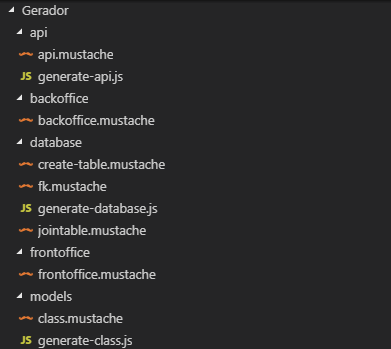

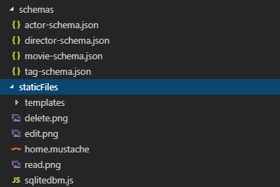

-   **api** :
    -   **api.mustache** : template dos **_api_** (_routes_) a gerar para os modelos;
    -   **generate-api.js** : código para utilizar o template do _api.mustache_ para gerar os routes de todos os modelos;
-   **backoffice** : 
    -   **backoffice.mustache** : template do _backoffice_ em que se gera os _CRUD_ de todos os modelos;
-   **database** : 
    -   **create-table.mustache** : template a para gerar as tabelas dos modelos gerados;
    -   **fk.mustache** : template a para gerar as tabelas das relações entre modelos gerados;
    -   **generate-database.js** : código para utilizar o template do create-table.mustache_ e_fk.mustache_ para gerar as tabelas dos modelos e suas relações;
    -   **jointable.mustache** : código para utilizar o template do create-table.mustache_ e_fk.mustache_ para gerar as tabelas dos modelos e suas relações;??
-   **frontoffice** : 
    -   **frontoffice.mustache** : template utilizado para gerar os uma routa no _front-end_;
-   **models** : 
    -   **class.mustache** : template das classes;
    -   **generate-class.js** : código para utilizar o template do _class.mustache_ para gerar as classes dos modelos;
-   **schemas** : 
    -   **actor-schema.json** : esquema  _JSON_ que representa o modelo actor no projecto;
    -   **director-schema.json** : esquema  _JSON_ que representa o modelo director no projecto;
    -   **movie-schema.json** : esquema  _JSON_ que representa o movie(filme) acrtor no projecto;
    -   **tag-schema.json** : esquema _JSON_ que representa o tag(categoria) acrtor no projecto;
-   **staticFiles** : ficheiros _templates_ e imagens utilizadas no _front-end_;

**O que são templates?**

Templates são ficheiros pré-formatos que fornecem a estrutura inicial que depois só se tem de preencher com os datos que se pretende encher.

Foram utilizados o sistema de templates de _mustache_ para a integração dos modelos e para a geração dos _Views_.

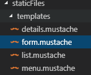

<h3>

**#Especificação e descrição técnica de soluções encontradas e das configurações utilizadas**

</h3>

Foi pesquisado em muitos sites, mas a maior parte do código utilizado/resolvido foi da parte laboratorial da UC.

 

<h2>

#**Esquematização e análise as secções de código mais importantes no sistema**

</h2>

**_Backoffice_** : Realiza a geração de rotas e templates para a interação com a API, através de uma aplicação web.
Como por exemplo o código template do _router.get_ :
-   Esta parte do código estabele o _mapping_ dos object's a serem gerados;

-   Esta parte estabelece o código da função _get_ do router de forma a que utiliza todos os _schemas.

**_Frontoffice_** : Fornece funcionalidade e dados necessários para receber pedidos, configurar produtos complexos e fornecer serviços e suporte efetivos aos clientes. Inclui a gestão de relações com o cliente (CRM), automação da força de vendas, suporte ao cliente e serviço de campo.

    
 

<h2>

#**Identificação e descrição das opções tomadas e limitações existentes**

</h2>
Houve problemas em toda a fase de construção do projecto, mas às partes mais problemáticas foram as da parte do frontoffice e na parte de backoffice na parte da construçao e relaçao entre os modelos expecialmente na parte na relações M-M.

<!-- 

 

-->

<h2>

**#Descrições dos modelos utilizados**

</h2>

Na construção do website, os modelos acordados são:

- **actor-schema.json** - modelo schema que representa os actores dum movie. O actor tem uma relação 1-M com o movie pois o movie pode ter vários actores, mas o actor só pode actuar num movie de cada vez;
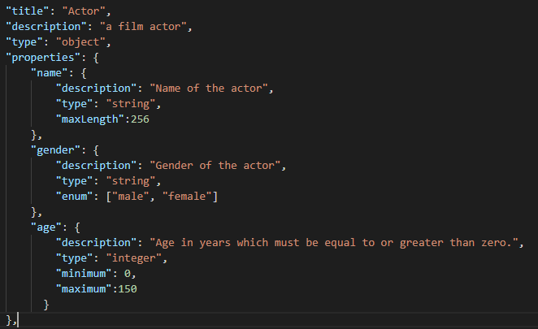

- **director-schema.json** - modelo schema que representa os director dum movie. O actor tem uma relação 1-M com o movie pois o movie pode ter vários actores, mas o actor só pode actuar num movie de cada vez;
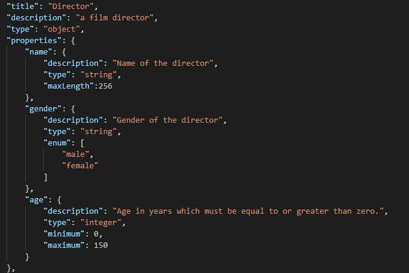

- **tag-schema.json** - modelo schema que representa a categoria em que o movie se encaixa. O modelo tag (ou categoria) tem uma relação M-M com o movie pois o movie pode ter várias tags e o tag pode estar em vários movies vez;
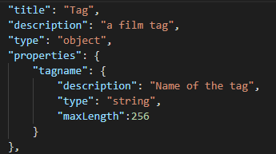

- **movie-schema.json** - modelo schema que representa o movie criado.
  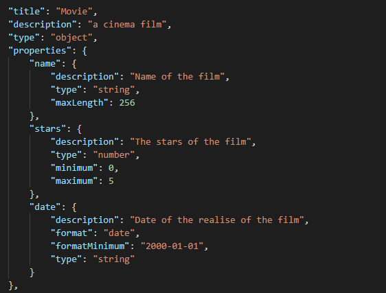