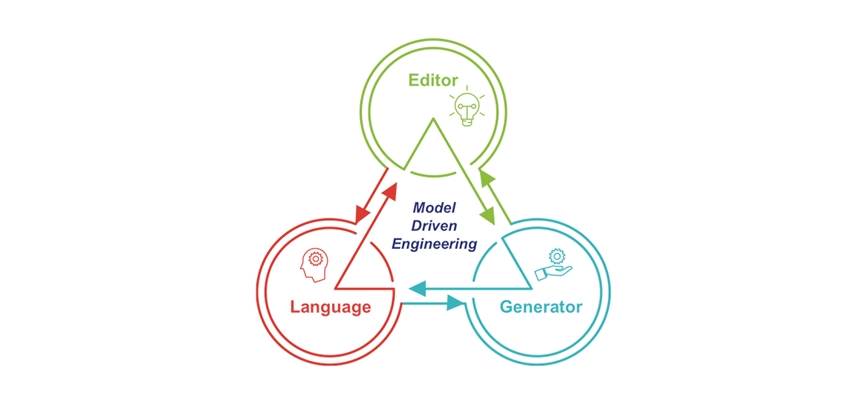

    <h1> Projeto DBM 18/19</h1> 
    <h2>Manual de Utilizador</h2>
    

<h4>Professor: Filipe Mariano</h4>
<h4>Alunos: </h4>
<h5><li>Bruno Rodrigues nº:150221041</h5>
<h5><li>Tiago Rodrigues nº:160221081</h5>

#Indice

1. [Glossário](#Glossário)
2. [Introducão](#Introducão)
3. [Descrição](#Descrição)
4. [Utilização](#Utilização)
   

<h2>

**#Glossário**

</h2>

- **_Template_** : um _template_ é um ficheiro que foi criado com um _layout_ e com um formato geral para ser utilizado num grupo de documentos ou num documento genérico. Por exemplo, um programa pode ter uma configuração de modelo para um currículo;

- **_Gerador_** : um gerador de código gera uma seqüência d código em que consiste nos modelos, nas bases de datos dos modelos , nas suas rotas e os _layot's_ da _web-page_;

- **HTML** : linguagem utilizada na construção de páginas na web;

-   **_mustache_**: uma implementação de sistema de templates de _mustache_ em _JavaScript_. _Mustache_ é uma sintaxe de _templates_ sem lógica. Pode ser utilizado para HTML, arquivos de configuração ou código fonte.

-   **_node.js_**: é um interpretador, open-source (codigo aberto), de código JavaScript de modo assíncrono e orientado a eventos;

-   **_api_**: conjunto de rotinas e padrões estabelecidas num software para a utilização das suas funcionalidades por aplicações que não pretendem envolver-se na implementação do software, mas apenas usar seus serviços;

<h2>

**#Introducão**

</h2>

Este projecto foi desenvolvido com o objectivo de utilizar as ferramentas e conhecimentos adquiridos na unidade curricular de DBM (Desenvolvimento Baseado em Modelos). Iremos também divulgar o que foi utilizado e as terminologias utilizadas/adquiridas ao longo da controção deste projecto.
Para operar o nosso projecto é necessário que o utilizador possuia VSC (_Visual Studio Code_).

<h2>

**#Descrição**

</h2>

-   A homepage incial, através da qual é gerado o _website_ exemplo;

-   Exemplo de website gerado
    -   Aqui iram aparecer os top 3 filmes(movie's);
    

    -  A página onde são listados todos os filmes criados;
    

    -   A página onde são listados os atores criados;
    

    -   A página onde são listadas as tag(categorias) criadas
    

    -   A página onde são listados os directores criados;
    

    -   A página para inserir novos actores, e o resultado;
    

    -   As funções por imagens e a sua funcionalidade;
    

<h2>

**#Utilização**

</h2>

O uso do nosso _website generator_ começa quando o utilizador active o servidor e o inicializa, depois irá a um _browser_ e coloque http://localhost:8081/ na barra de pesquisa do mesmo. Assim que chega ao site o utilizador tem disponivel um botão:

Este botão irá encaminhar o utilizador para outro servidor http://localhost:8082/Home :

Aqui, o utilizador tem a opção de criar , editar, ver e remover (operações CRUD) de todos os modelos gerados no projecto como é mostrado e explicado na Descrição.

